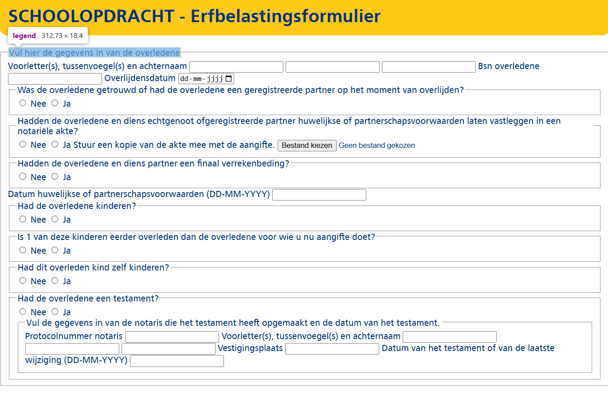
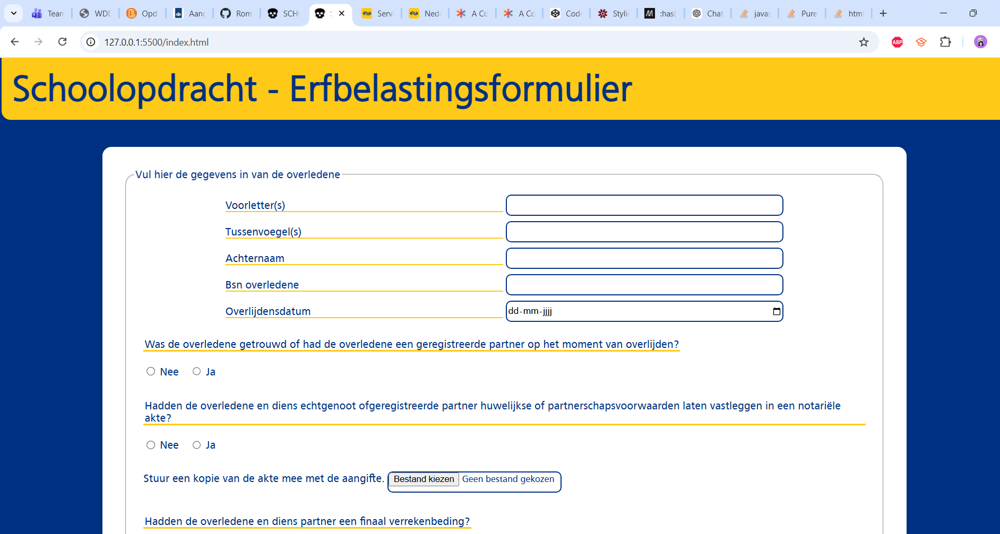

# browser-technologies-assignment
Dit is een schoolopdracht voor de CMD minor web design &amp; development.

## Maandag 16-2-2026 Checkout
### Browser Technologies
Vandaag ben ik begonnen met de opdracht die we hebben gekregen, ik heb onderzoek gedaan naar HTML input elementen. Ook heb ik het artikel 'It’s hard to justify Tahoe icons' https://tonsky.me/blog/tahoe-icons/ gelezen.

Ik heb vooral gewerkt aan de html van de pagina. Dus het ziet er nog erg kaal uit.

## Dinsdag 17-2-2026 Checkout
### Browser Technologies
Vandaag heb ik gewerkt aan het design van het formulier. Hierbij heb ik met name de website responsive gemaakt en sommige input elementen gestyled. Ook heb ik de NS-kleuren toegepast en de header en de legend sticky gemaakt om de website toegankelijk te maken. 

Volgende keer wil ik de file input beter stylen en wil ik toevoegen dat sommige velden pas openklappen nadat een ander veld is ingevuld. Hierdoor krijgt het formulier hopelijk een betere UX.

Het formulier begint al ergens op te lijken.

## Vrijdag 20-2-2026 Weekly review 
Vandaag heb ik met Vasilis, Choice en Eva gekeken naar de voortgang van onze BT projecten. Hier heb ik uit gehaald dat het bijvoorbeeld beter is om divs te gebruiken in plaats van sections om mijn radio-buttons heen. Omdat ik deze container alleen om de divs heb gezet voor styling doeleinden.

Verder wil ik na de vakantie nog kijken naar een oplossing voor mijn sticky positioned element. Nu heb ik deze gestyled met javascript. Maar ik wil graag weten of er een css oplossing voor is. Zelf ben ik hier nog niet op gekomen.