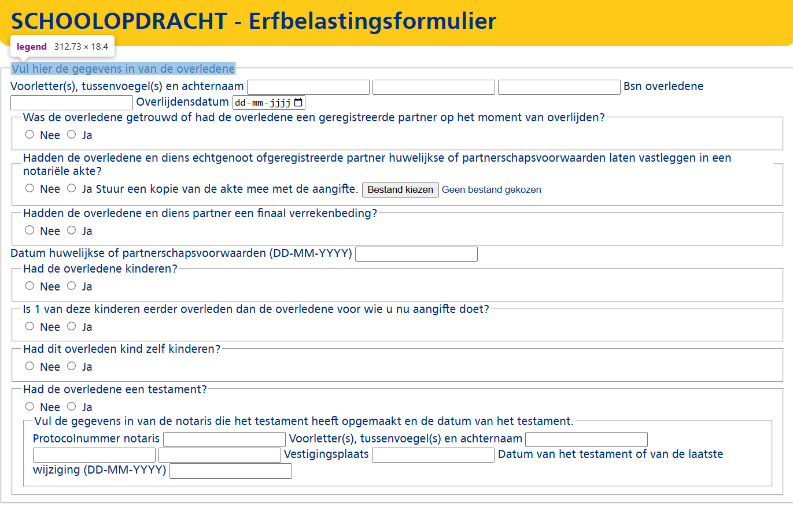
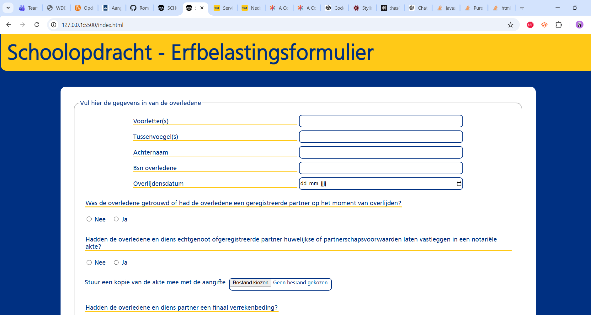
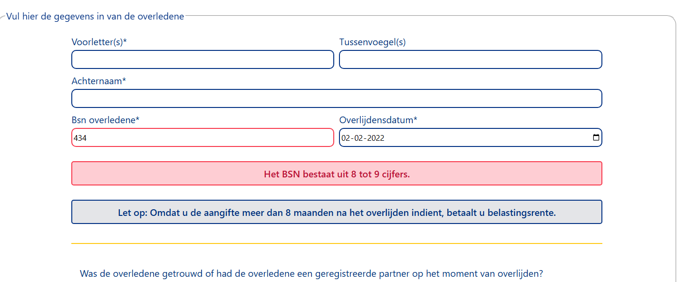

# browser-technologies-assignment
Dit is een schoolopdracht voor de CMD minor web design &amp; development.

## Maandag 16-2-2026 Checkout
### Browser Technologies
Vandaag ben ik begonnen met de opdracht die we hebben gekregen, ik heb onderzoek gedaan naar HTML input elementen. Ook heb ik het artikel 'It’s hard to justify Tahoe icons' https://tonsky.me/blog/tahoe-icons/ gelezen.

Ik heb vooral gewerkt aan de html van de pagina. Dus het ziet er nog erg kaal uit.

## Dinsdag 17-2-2026 Checkout
### Browser Technologies
Vandaag heb ik gewerkt aan het design van het formulier. Hierbij heb ik met name de website responsive gemaakt en sommige input elementen gestyled. Ook heb ik de NS-kleuren toegepast en de header en de legend sticky gemaakt om de website toegankelijk te maken. 

Volgende keer wil ik de file input beter stylen en wil ik toevoegen dat sommige velden pas openklappen nadat een ander veld is ingevuld. Hierdoor krijgt het formulier hopelijk een betere UX.

Het formulier begint al ergens op te lijken.

## Vrijdag 20-2-2026 Weekly review 
Vandaag heb ik met Vasilis, Choice en Eva gekeken naar de voortgang van onze BT projecten. Hier heb ik uit gehaald dat het bijvoorbeeld beter is om divs te gebruiken in plaats van sections om mijn radio-buttons heen. Omdat ik deze container alleen om de divs heb gezet voor styling doeleinden.

Verder wil ik na de vakantie nog kijken naar een oplossing voor mijn sticky positioned element. Nu heb ik deze gestyled met javascript. Maar ik wil graag weten of er een css oplossing voor is. Zelf ben ik hier nog niet op gekomen.

## Maandag 2-3-2026 
Ik heb een workshop over javascript validatie gevolgd. 
Vandaag heb ik validation toegevoegd aan sommige velden. Hier ben ik 4 uur mee bezig geweest.

Ook heb ik mij verdiept op de weekly geek van morgen. 

Morgen wil ik er voor zorgen dat vragen zichtbaar worden als ze nodig zijn.

## Dinsdag 2-3-2026
Wat heb je nodig voor het maken van een radio-button?

### Styling 
Voor de styling moet je before en after elementen gebruiken om het knopje te maken.

### Werking
Het moet bij elkaar in de groep zitten.
Hetzelfde als checkbox, maar je moet er voor zorgen dat wanneer je een aanvinkt, dat de andere uit zijn. 
En ze moeten door middel van pijltjes toetsen aangevinkt kunnen worden.

### a11y
Voor de label moet je een aria-labelledby gebruiken.
Je moet tab-index toevoegen, zodat de browser ziet dat je er op kunt tabben.

Wat heb je nodig voor het maken van een checkbox?

### Styling 
Voor de styling moet je before en after elementen gebruiken om het knopje te maken.

### Werking
Je moet een onclick en een onkeydown toevoegen zodat ze checkable zijn in JS.

### a11y
Div met daar in een label met een id. Voor de label moet je een aria-labelledby gebruiken.
Je moet tab-index toevoegen, zodat de browser ziet dat je er op kunt tabben.

Ideetjes:

# Patterns 
    -> progressiebalk
    -> Extra informatie weergeven voor iedere vraag
    -> 